# Hammurabi Game
By Tobias Heiss, Iacob Cosmin, Franz Innerbichler & Martin Islitzer

## Initial Sprint
### Fotodocumentation
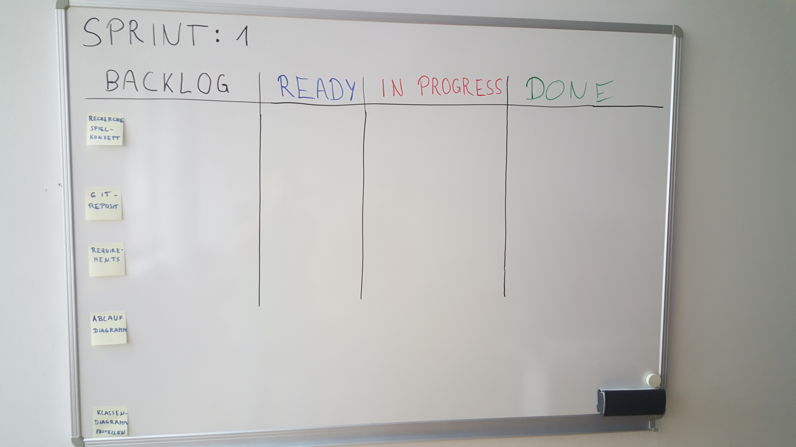
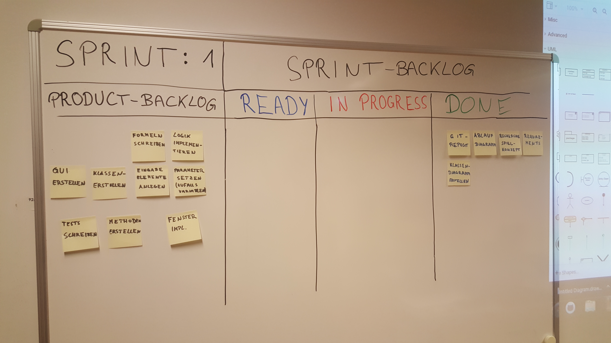
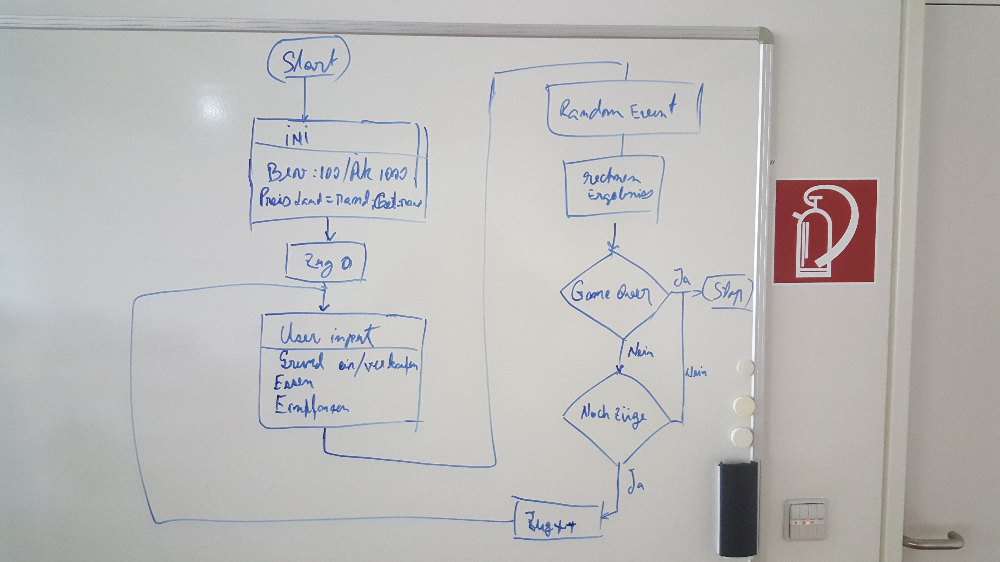
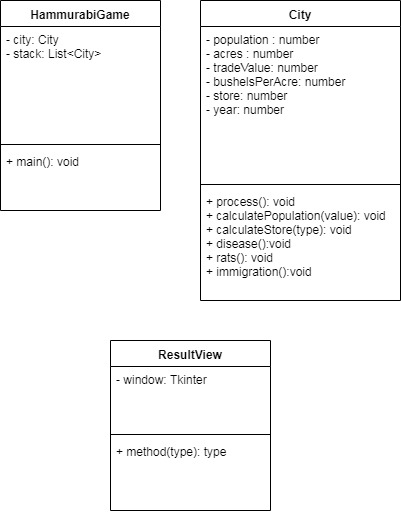

## Sprint 1
### Fotodocumentation
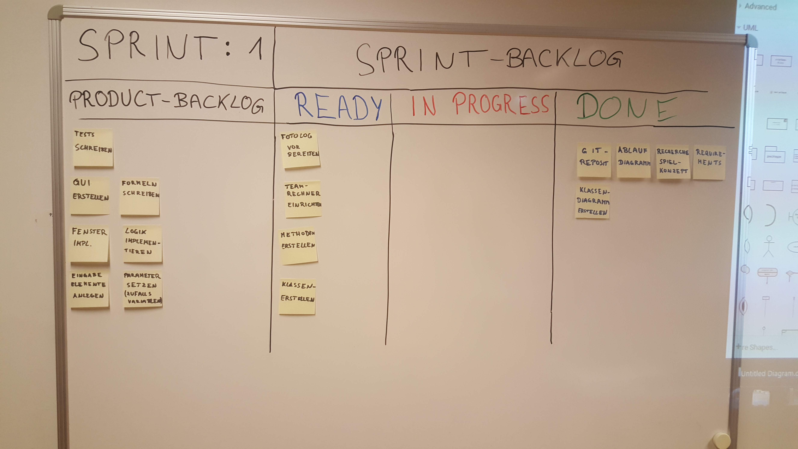
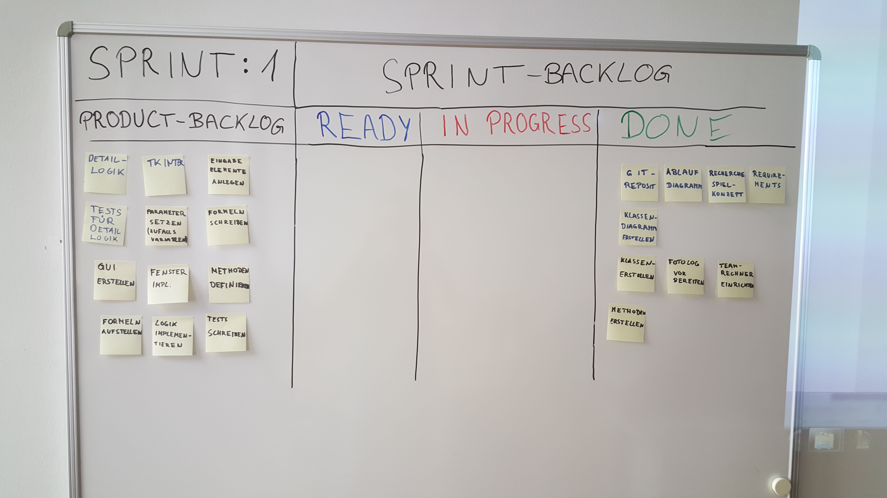

## Sprint 2
### Fotodocumentation
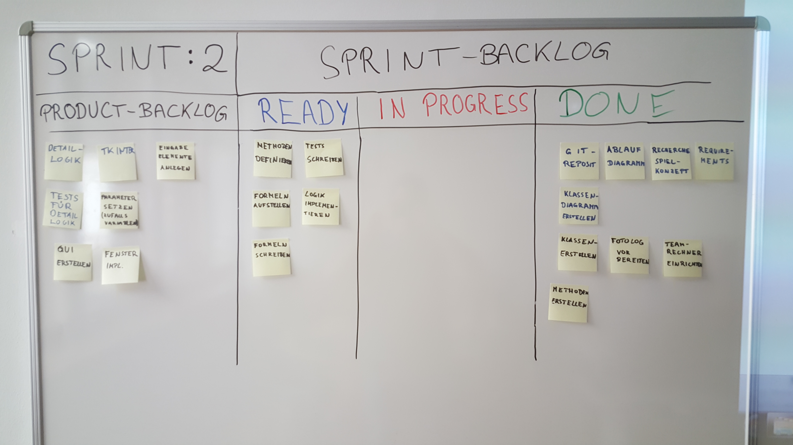
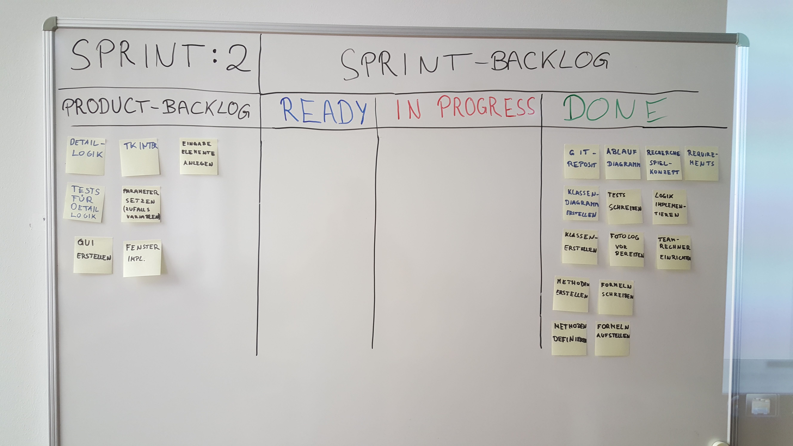

## Sprint 3
### Fotodocumentation
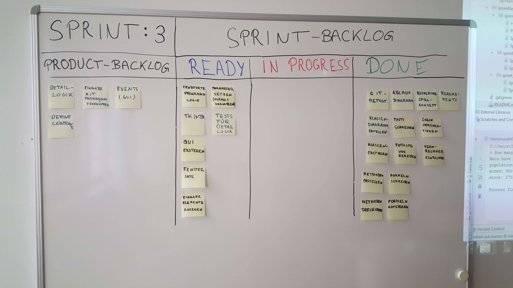
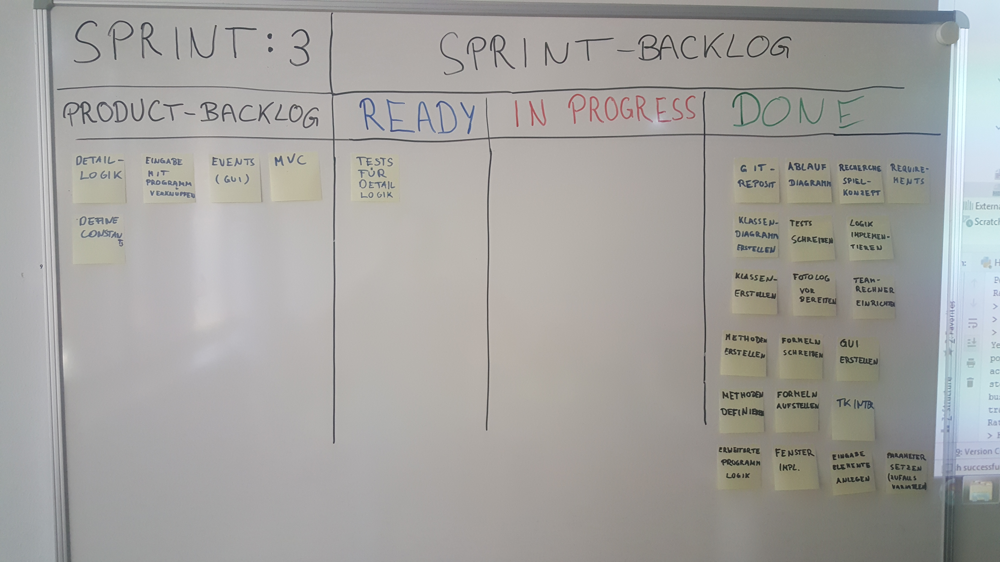

## Sprint 4
### Fotodocumentation
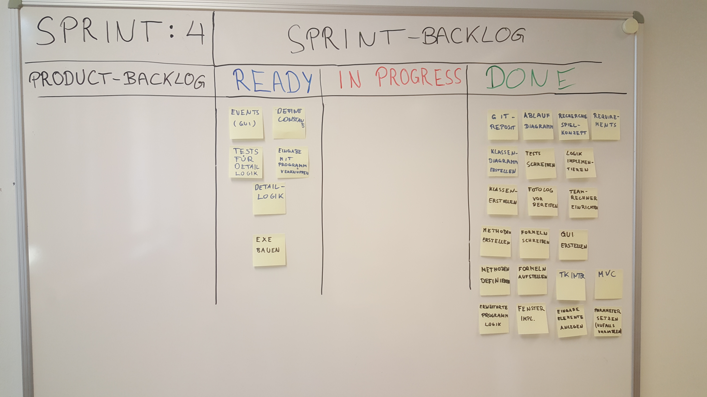
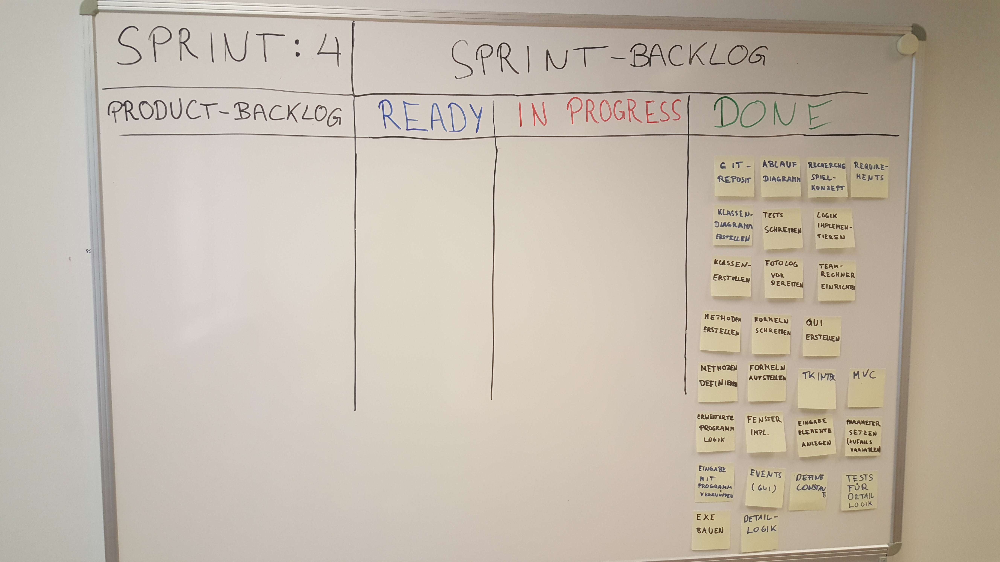
